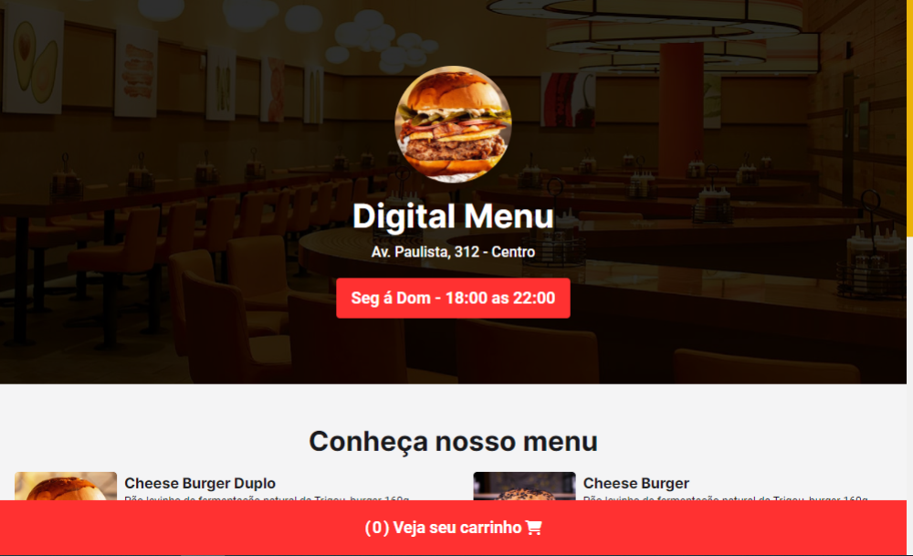

<div align="center">
  <h1>🔴 Project: Digital Menu</h1>
</div>

<div align="center">
  
</div>

<div align="center">
  <p>
    This project is a simple and intuitive digital menu that sends orders through the WhatsApp API, built with HTML, CSS and pure Javascript as a simple and cost-effective proposal for implementation, culminating in a great tool for sales in fast-food restaurants.
  </p>
</div>

<div align="center">
  <a href="https://classic.yarnpkg.com/lang/en/docs/" target="_blank">
    
  </a>
  <a href="https://tailwindcss.com/" target="_blank">
    
  </a>
  <a href="https://www.npmjs.com/package/toastify-js" target="_blank">
    
  </a>
  <a href="https://choosealicense.com/" target="_blank">
    
  </a>
  <a href="https://vercel.com/" target="_blank">
    
  </a>
</div>

## 🛠️ Technologies

- HTML5, CSS3, JS ES6+
- [Node e Yarn](https://nodejs.org/)
- [Tailwind CSS](https://tailwindcss.com/)
- [Toastify-js](https://www.npmjs.com/package/toastify-js)
- [Eslint](https://eslint.org/)
- [Prettier](https://prettier.io/)

## 📣 Funcionalities

- Add product to cart
- Visual operation indicator
- Remove product from cart
- Shopping cart in modal
- Sending orders via WhatsApp API
- Customized visual alerts

## 💿 Installing

Install the project with the following command

```bash
  yarn install
```

## 🚀 Deploy

To deploy this project, execute

```bash
  vercel
```

## 💻 Running CSS

To run the CSS, run the following command

```bash
  yarn start
```

## 🧰 Used stacks

**Front-end:** HTML5, Tailwind CSS, Javascript, Toastify-js

**Back-end:** Not used

## 📸 Screenshots



## 📝 License

This project is under [MIT license](LICENSE).
